- [UX](#ux)
- [Métodos e ferramentas: Estratégia de produto](#métodos-e-ferramentas-estratégia-de-produto)
  - [Pixar story telling](#pixar-story-telling)
  - [Personas](#personas)
  - [Mapas de stakeholdes](#mapas-de-stakeholdes)
  - [Future Press Releases](#future-press-releases)
  - [Blue Sprint](#blue-sprint)
  - [Touch points](#touch-points)
  - [Mapa de jornada do usuário](#mapa-de-jornada-do-usuário)
  - [Ecossistema](#ecossistema)
  - [Golden Path](#golden-path)
  - [Proposta de valor](#proposta-de-valor)
  - [Business Model Canvas](#business-model-canvas)
  - [Canvas da proposta de valor](#canvas-da-proposta-de-valor)
  - [Benchmark](#benchmark)
  - [Primeiro tweet](#primeiro-tweet)
  - [Lightning talk](#lightning-talk)
  - [Métricas](#métricas)
- [Métodos e ferramentas: Geração de ideias](#métodos-e-ferramentas-geração-de-ideias)
  - [Double diamond](#double-diamond)
    - [4 ETAPAS](#4-etapas)
  - [HMW - Como nós poderíamos?](#hmw---como-nós-poderíamos)
  - [Crazy 8 ‘s](#crazy-8-s)
  - [Story Boards](#story-boards)
  - [Fluxo de usuário](#fluxo-de-usuário)
  - [Taxonomia](#taxonomia)
  - [Sitemap](#sitemap)
  - [Princípios para Design](#princípios-para-design)
  - [Moodboard](#moodboard)
- [Métodos e ferramentas: Planejamento](#métodos-e-ferramentas-planejamento)
  - [Roadmap](#roadmap)
  - [Histórias de usuário](#histórias-de-usuário)
    - [Modelo tradicional](#modelo-tradicional)
    - [Modelo melhorado (Job Story)](#modelo-melhorado-job-story)
  - [Critério de aceitação](#critério-de-aceitação)
- [Métodos e ferramentas: Validação e Pesquisa](#métodos-e-ferramentas-validação-e-pesquisa)
  - [Estudo diário](#estudo-diário)
  - [Landing Page](#landing-page)
  - [Teste A/B](#teste-ab)
  - [Card Sorting](#card-sorting)
  - [Auditoria de conteúdo](#auditoria-de-conteúdo)
  - [Canais de feedbacks](#canais-de-feedbacks)
  - [Entrevista de usabilidade](#entrevista-de-usabilidade)
  - [Pesquisas qualitativas](#pesquisas-qualitativas)
- [Métodos e ferramentas: Desenho de interface](#métodos-e-ferramentas-desenho-de-interface)
  - [sketches, Wireframes, Protótipos e Guias de Estilos](#sketches-wireframes-protótipos-e-guias-de-estilos)
    - [sketches](#sketches)
    - [Wireframe](#wireframe)
    - [Protótipos](#protótipos)
    - [Styleguides - Guia de estilos](#styleguides---guia-de-estilos)
  - [sketches - Frames](#sketches---frames)
  - [sketches - Texto e conteúdo](#sketches---texto-e-conteúdo)
  - [Sketches - Representar fluxos do usuário](#sketches---representar-fluxos-do-usuário)
  - [Usabilidade e Checklist de experiencia](#usabilidade-e-checklist-de-experiencia)
    - [Usabilidade](#usabilidade)
      - [Informações em poucas quantidades](#informações-em-poucas-quantidades)
      - [Hierarquia funcional](#hierarquia-funcional)
      - [Simplificação de formulários](#simplificação-de-formulários)
      - [Adivinhar intenções, Estados, Prevenções de erros](#adivinhar-intenções-estados-prevenções-de-erros)
      - [Tempo do usuário](#tempo-do-usuário)
      - [Microinterações](#microinterações)
      - [Personalidade, microtextos e linguagem](#personalidade-microtextos-e-linguagem)
      - [Checklist de UX](#checklist-de-ux)
        - [Simplicidade](#simplicidade)
        - [Acionável](#acionável)
        - [Inteligente](#inteligente)
        - [Agradável](#agradável)
        - [Relevante](#relevante)
  - [Métricas de sucesso](#métricas-de-sucesso)
    - [Google Analytics](#google-analytics)
    - [Métricas de vaidade](#métricas-de-vaidade)
    - [KPI](#kpi)
    - [NPS - Net Promoter Score](#nps---net-promoter-score)
  - [CTR - Click through rate](#ctr---click-through-rate)
  - [DAU - Daily active users](#dau---daily-active-users)
    - [Cohort](#cohort)
  - [Churn rate - Taxa de evasão](#churn-rate---taxa-de-evasão)
  - [Growth rate - Taxa de crescimento](#growth-rate---taxa-de-crescimento)
  - [LTV e CAC](#ltv-e-cac)
    - [CAC](#cac)
  - [Base line - Linha de base](#base-line---linha-de-base)
  - [HEART - Framework de métricas de UX](#heart---framework-de-métricas-de-ux)
    - [Como implantar?](#como-implantar)
  - [MVP](#mvp)
- [Processos de trabalho - Lean UX: Base e princípios](#processos-de-trabalho---lean-ux-base-e-princípios)
  - [Base Design Thinking](#base-design-thinking)
  - [Base metodologias ágeis](#base-metodologias-ágeis)
  - [Base Lean Startup](#base-lean-startup)
  - [SCRUM - Termos e papéis](#scrum---termos-e-papéis)
    - [Atores](#atores)
    - [Sprint](#sprint)
    - [Backlog do produto](#backlog-do-produto)
    - [Backlog da sprint](#backlog-da-sprint)
    - [Ritos](#ritos)
  - [Lean UX](#lean-ux)
    - [Equipes multidisciplinares](#equipes-multidisciplinares)
    - [Times pequenos, dedicados, juntos](#times-pequenos-dedicados-juntos)
    - [Progresso é valor, não é só entregáveis](#progresso-é-valor-não-é-só-entregáveis)
    - [Times focados em problemas](#times-focados-em-problemas)
    - [Remova o desperdício](#remova-o-desperdício)
    - [Pequenas entregas](#pequenas-entregas)
    - [Entrega continua](#entrega-continua)
    - [Saia do prédio](#saia-do-prédio)
    - [Conhecimento compartilhado](#conhecimento-compartilhado)
    - [Times nivelados sem rockstars](#times-nivelados-sem-rockstars)
    - [Externalize o trabalho](#externalize-o-trabalho)
    - [Criar > Analisar](#criar--analisar)
    - [Apender antes de escalar](#apender-antes-de-escalar)
    - [Permissão para falhar](#permissão-para-falhar)
    - [Saia do negócio de entregáveis](#saia-do-negócio-de-entregáveis)
  - [Visão prototipação e valor](#visão-prototipação-e-valor)
    - [Principais conceitos](#principais-conceitos)
    - [Preparação](#preparação)
    - [Definição de problema](#definição-de-problema)
    - [Suposições](#suposições)
    - [Priorização](#priorização)
    - [Hipóteses](#hipóteses)
    - [Valor - Objetivos](#valor---objetivos)
    - [Personas](#personas-1)
    - [Funcionalidades](#funcionalidades)
- [Referencias](#referencias)
- [Conteúdos para validar posteriormente](#conteúdos-para-validar-posteriormente)

# UX

# Métodos e ferramentas: Estratégia de produto

## Pixar story telling

- Narrativas das histórias
    - Era uma vez _____
    - Todos os dias ______
    - Um certo dia _____
    - Por causa disso_______
    - Até que finalmente _______

Exemplo

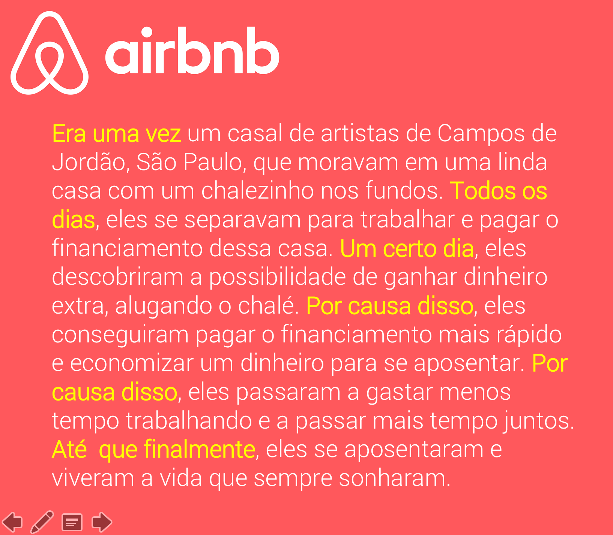

## Personas

Personas são personagens fictícios criados para representar os diferentes tipos de usuários para um produto. É uma forma de criar empatia do seu time com os consumidores no processo de design.

- Identificar o público alvo
- Gerar consenso no time
- Entender as dores
- Olhar o problema sob a ótica do usuário

Método proto-personas

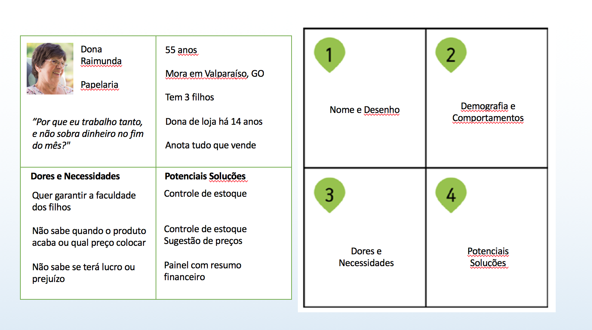

## Mapas de stakeholdes

Publico estratégico. Pessoas ou grupo que tem interesse no seu negócio.

- Identificar pessoas chave
- Entender os interesses
- Entender os fatores críticos de sucesso

## Future Press Releases

Ferramenta utilizada na comunicação para distribuir em diversos canais de mídia uma visão única sobre determinado assunto. No UX é utilizada para estabelecer uma visão de futuro representando como seria o dia em que o produto foi lançado.

- Estabelecer uma visão de futuro do produto
- Gerar consenso com a equipe

O que colocar na press release do futuro

- Titulo e sub-titulo
- Definição do problema e do cliente
- Detalhes da solução ( Produto )
- O que é o produto com suas palavras
- O que faz os clientes amarem ( Na voz deles )
- Como os usuários podem começar a utilizar o produto.

> 💡 Utilizar quando você precisar deixar uma mensagem clara do que é o seu produto para os seus patrocinadores e stakeholders e quando quiser ajudar a equipe a trabalhar na mesma página.

## Blue Sprint

Uma representação dos touchpoints entre usuário e produto ou serviço, bem como os processos necessários para que iteração aconteça.

> 💡 Usar quando precisar melhorar um processo de uma experiência de serviço

*Utilizado para*

- Clarear o processo
- Entender as emoções
    - Nesta etapa é legal medir as emoções que o cliente está sentindo no determinado momento
- Identificar as melhorias

## Touch points

Pontos de contato que os stakeholders tem com seu produto

Exemplos

- Media touchpoint
- SAC touchpoint
- System touchpoint
- …

## Mapa de jornada do usuário

Entender o antes, durante e depois do usuário.

> 💡 Mapa que mostra os passo do consumir ai usar um produto. Permite entender o que o usuário pensa, sente e o que ele consome para tomar decisões.

- Identificar as entradas e saídas
- Pensar com empatia

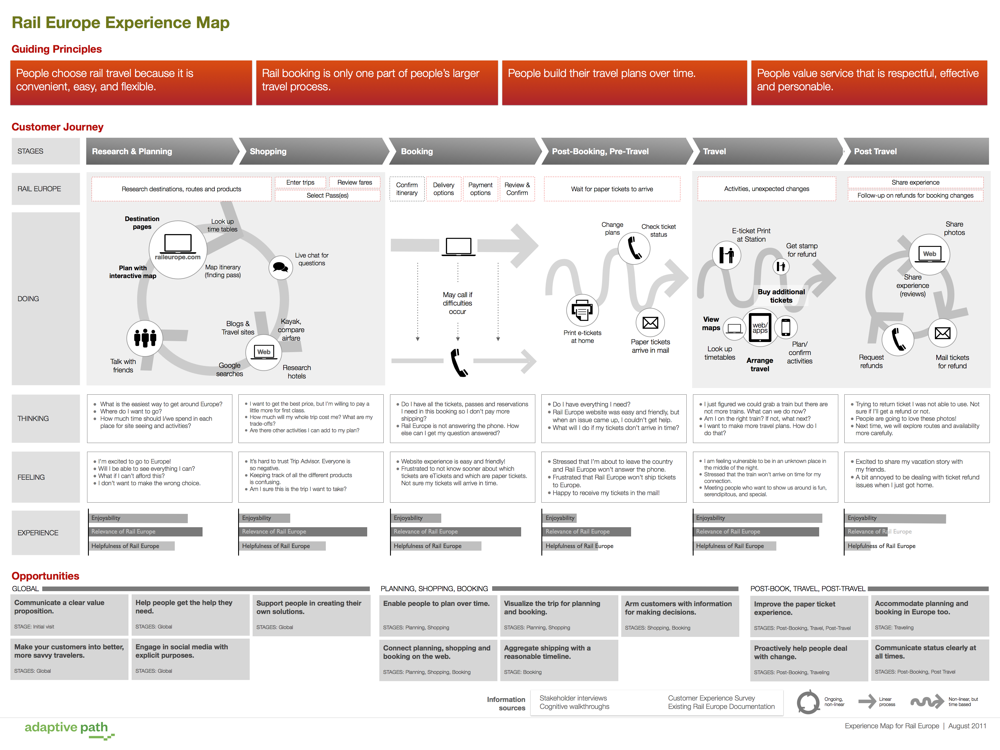

## Ecossistema

Representação clara de todos os pontos de contato do usuário com sua marca ou produto. Busca identificar oportunidades de melhoria em pontos que muitas vezes não nos preocupamos.

> 💡 Use Ecossistema quando precisar identificar todas as formas de interação do usuário com seu produto para não deixar nenhuma porta de entrada para insatisfações e más experiencias.

- Entender os pontos de contato do usuário com o seu produtos
- Identificar oportunidades de melhoria na experiencia de forma abrangente

## Golden Path

Caminho feliz

> 💡 É o “caminho feliz” que o usuário percorre para realizar uma atividade. É a jornada do usuário que 90% dos usuários vão percorrer ao utilizar o produto.

- Detalhar a jornada chave do usuário
- Melhorar o caminho mais rápido e principal para entrega de valor
- conectar as histórias de usuário mais importantes a serem priorizadas

## Proposta de valor

- Entender as tarefas do cliente
- Entender as dores do cliente
- entender o que o cliente precisa
- Direcionar funcionalidades para resolver as dores e necessidades.

**Escrevendo uma proposta de valor**

Para `<Esses clientes>`

Que `<Tem essa necessidade>`

Oferecemos `<Esse produto>`

Que `<Gera esse beneficio>`

**Posicionamento**

Diferentemente de `<Competidor>`

Nosso produto `<Faz isso diferente>`

## Business Model Canvas

[https://analistamodelosdenegocios.com.br/produtos-gratuitos/](https://analistamodelosdenegocios.com.br/produtos-gratuitos/)

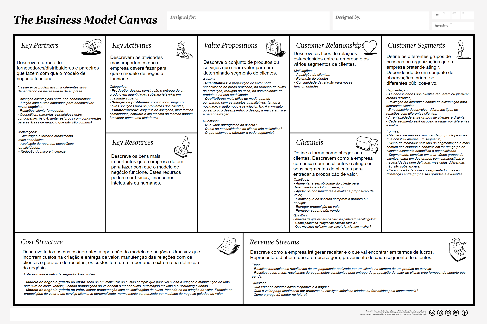

## Canvas da proposta de valor

> 💡 Método para definir o que o produto é, para quem ele foi criado e como/quando ele será usado.

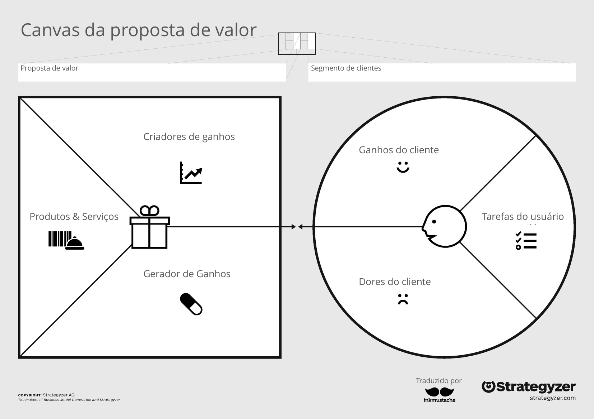

> 💡 Use a proposta de valor quando quiser explicar o motivo do seu usuário escolher o seu produto ou serviço entre outras alternativas que ele já tem.

## Benchmark

Análise de competidores que esclarece as funcionalidades comparando=as uns com os outros

- Identificar forças e ameaças dos produtos e serviços dos competidores
- Gerar consenso sobre uma linha de base de qualidade com stakeholders
- Desenvolver uma estratégia para superar o que já existe

[https://www.gartner.com/en](https://www.gartner.com/en)

> 💡 Da para utilizar o BenchMark para ter novas ideias, assim você conhece as funcionalidades dos competidores e busca fazer algo que os supere.

> 💡 Utilize o benchmark quando quiser entender o que está sendo criado no mercado para identificar oportunidades de inovar

## Primeiro tweet

> 💡 O “Primeiro Tweet” é um exercício inspirador que simula como seria o primeiro tweet de uma empresa depois que ela se tornasse pública para os usuários, levando em consideração a limitação do Twitter de 140 caracteres.

- Inspirar a visão de forma simples
- Entender o que realmente chama a atenção do usuário

Como fazer

- Peça para o time imaginar que já é hora de lançar um novo produto ou funcionalidade
- Qual é a primeira mensagem que vamos publicar no Twitter? (Mensagem curta)
- Como inspiração mostre um exemplo para ajudá-los a entender.

**Exemplo**

> 💡 Tem dificuldade para saber a produtividade de seu time e o que fazer para melhorá-la? Conheça o raio-x detalhado da sua área no #stfdigital

> 💡 Use para gerar consenso no time sobre a visão do produto antes que iniciar exercícios de design thinking ou design sprints.

## Lightning talk

Palestra relâmpago

O lightning talk é uma apresentação curta. Uma apresentação relâmpago. Várias pessoas falam por poucos minutos com objetivos de compartilhar diversas visões.

- Perceber um desafio sob óticas diferentes como:
    - tecnologia
    - Negócio
    - Usuário
- **Lightning talk**
    - O que o negócio precisa?
    - O que trará mais performance?
    - O que é possível?
    - Que features podem ser construídas?
    - O que as pessoas precisam?
    - O que elas adorariam?
- **Cuidados para preparar sua apresentação:**
    - Saiba quem é a audiência e fale sua linguagem
    - Menos é main
    - Escreva um Script
    - Apresente e teste seu tempo
    - Use imagens sempre que possível
    - Conheça a tecnologia que vai usar
    - Fale devagar e fique atento as dúvidas

> 💡 Usado quando precisa avaliar a viabilidade do negócio

## Métricas

> 💡 Métricas de negocio e de UX são utilizadas para saber se seu negócio está tendo o sucesso esperado.

- Entender o que pode ser medido
- Alguns atalhos para medição
- Há um capitulo somente para aprofundar!

*Para validar o que o usuário faz no seu site*

> 💡 GOOGLE ANALYTICS - MIXPANEL

# Métodos e ferramentas: Geração de ideias

## Double diamond

> 💡 São etapas de ideação base do design thinking para viabilizar a geração de ideias, decidir o que é relevante, refinar as ideias e projetar uma solução.

- Gerar ideias de forma estruturada
- Aguçar a criatividade
- Trabalhar em equipe para construir conhecimento
- Entender de verdade o que as pessoas precisam

> 💡 “A pergunta certa é geralmente main importante do que a resposta certa á pergunta errada” - Alvin Toffler

> 💡 “Os nossos maiores problemas não estão nos obstáculos do caminho, mas na escolha da direção errada” - Augusto Cury

### 4 ETAPAS

- Pesquisa e descoberta - **Descobrir**
- Insights e definições - **Definir**
- Ideação - **Desenvolver**
- Protótipos e entregas - **Entregar**

> 💡 Utilize o duplo diamante quando precisar gerar ideias que saiam do senso comum, mas sem se perder o rumo como sessões de brainstorming convencionais.

## HMW - Como nós poderíamos?

> 💡 É uma técnica simples para estabelecer uma mesma linguagem na definição de dúvidas sobre um produto.

- Descrever as perguntas certas para posteriormente buscar as respostas

Exemplo de perguntas

- Como poderíamos - Evitar a fila nos bancos permitindo atendimento video conferencia agendada
- Como poderíamos - Permitir auto ajuste de limite de crédito
- Como poderíamos - Facilitar o investimento baseado no perfil

> 💡 Utilize o How Might We para aumentar o leque de soluções sobre seu produto.
Pode ser utilizado na fase de descobrir do double diamond.

## Crazy 8 ‘s

> 💡 É uma técnica de trabalho individual em que as pessoas buscam 8 soluções diferentes em muito pouco tempo para o mesmo problema.

- Evitar ideia óbvias e sair da zona de conforto
- Aquecer a criatividade
- Criar boa ideias

> 💡 Utilize quando você precisar buscar novas ideias e sair do óbvio

## Story Boards

> 💡 Criar storyboards é criar um desenho que mostra como um usuário está experimentando um contexto que tem um problema.

- Entender como engajar mais pessoas utilizando o pensamento visual

> 💡 Utilize o storyborad juntamente com o pixar storytelling para ajudar sua equipe a ter ideias cada vez melhores

## Fluxo de usuário

> 💡 Fluxo de usuário é a representação gráfica das iterações do usuário com seu produto
Caso seja um APP ou Sistema, exibira as telas usadas até que a tarefa seja concluída.

- Definir um conjunto de passos para o usuário completar uma tarefa
- Destacar quais partes do produto estão envolvidas nessa tarefa

> 💡 Utilize o fluxo do usuário para deixar claro a sequência de atividades e telas necessárias para execução de uma tarefa

## Taxonomia

> 💡 Uma exploração de diversas formas de categorizar conteúdos e informações.
A organização do conteúdo e dos rótulos ajudam o usuário a navegar com maior facilidade pelo site.

- Organizar as áreas mais relacionadas em um site ou sistema
- Deixar mais implícito as coisas para o usuário
    - De maneira que ele encontre o que procura com mais rapidez.

Taxonomia urso (Exemplo)

## Sitemap

> 💡 Sitemaps são uma forma de representar a taxonomia de um site. Um diagrama hierárquico que mostra a estrutura do site.

CONFRONTE AS INFORMAÇÕES COM O USUÁRIO

- organizar a hierarquia do site
- Organizar de uma jeito que usuário encontre as informações
- Entender o que precisa ser criado ou o que está faltando

> 💡 Utilize cardsorting para melhorar os resultados

Perguntas a serem feitas

- A taxonomia suporta a jornada?
- Diferentes personas entendem?
- Há alguma categoria com só um item?
- Há mais de 7 categorias?

## Princípios para Design

> 💡 É uma técnica de estabelecimento de princípios para nortear todo processo de planejamento e construção.

- Definir o que você espera que os usuários pensem sobre seu produto e trabalhar na direção de atingir esse objetivo
    - Divertido
    - Fácil
    - Útil todos os dias
    - Fácil de aprender

## Moodboard

> 💡 Representação visual de elementos e referências (No estágio inicial do protejo) ajudarão a definir a aparência do produto.

- Quadro de emoções
- Colocar a equipe no clima do projeto
- Obter referencias de inspiração
- Gerar empatia com como os eu cliente vê o mundo

> 💡 Utilizar quando quiser estampar visualmente as suas ideias em algum lugar, exemplificando cores, texturas, formas e estilos.

> 💡 “Seria como conhecer uma pessoa sem vê-la, só pelas roupas que tem no armário, musicas que ouve, cores que gosta, filmes que costuma ver” - Letícia Motta

# Métodos e ferramentas: Planejamento

## Roadmap

> 💡 Ferramenta para mostrar ao time e aos stakeholders a visão do produto em alto nível. Não precisa incluir erros e features menores.

- Planejar o futuro do time
- Comunicar a estratégia
- Encadear as entregas

**Não é gráfico de Gannt!**

**Dicas:**

- Olhe para o roadmap como um plano
- Bugs podem aparecer
- É muito difícil planejar com boa visibilidade (Longo prazo)

**Vender ciclos de desenvolvimento (Meses)**

## Histórias de usuário

- Descrever funcionalidades
- Evitar construir o produto com base na paixão
- Transmitir os requisitos de forma simples e leve conectando a funcionalidade ao usuário e a sua necessidade.

### Modelo tradicional

- Eu, como ___
- Quero ___
- Para isso ___

### Modelo melhorado (Job Story)

> 💡 Descrição clara de uma necessidade do usuário sob a ótica dele.

- Eu, como PERSONA
- Quando estou SITUAÇÃO/CONTEXTO
- Quero MOTIVAÇÃO
- Para que eu possa VALOR

> 💡 Use o job Story para criar o seu backlog de produto, a lista de funcionalidades que você precisa criar.

## Critério de aceitação

- Fazer oque o usuário precisa
- Cumprir corretamente com os requisitos

# Métodos e ferramentas: Validação e Pesquisa

## Estudo diário

- Aprender todos os dias
- Produto nunca será perfeito
- Seu concorrente nunca vai parar
- Seu usuário não vai parar

Dicas

- Entre em grupos do mercado
- Acompanhe noticias
- Siga os guros ( O pessoal que lasca conteúdo bom sobre o assunto )
- Fique antenado
- Aprenda com os melhores
- Compartilhe o que aprendeu
    - É sempre bom devolver para a sociedade aquilo que ela te ajudou a aprender

## Landing Page

> 💡 Landing pages são páginas de aterrissagem para seu produto

- Testar a conversão
- Muito usada em teste A/B
- Para onde você leva o usuário na campanha
- Menos links para manter o foco
- Manter o foco na proposta de valor
- Call to action

Unbounce pode ajudar

## Teste A/B

> 💡 Oferecer duas diferentes visões do produto para verificar qual delas melhor converte a ação

- Descobrir qual abordagem é mais adequada
- Sempre modifique apenas 1 elemento do site

*Perguntas a serem feitas*

- Sua amostra é significativa?
- Qual é o grau de certeza do resultado?

*Links que podem ajudar*

[https://resultadosdigitais.com.br/](https://resultadosdigitais.com.br/)

*Google analytics*

## Card Sorting

> 💡 Pedir para que usuários agrupem conteúdos e funcionalidade em categorias que façam sentido para elas

- Melhorar a organização da navegação
- Melhorar a encontrabilidade dos conteúdos

*Dicas*

- A arquitetura da informação é a base do seu site ou app
- Ao criar a arquitetura do site, envolva os usuários
- Tente realizar com 5 participantes
- Use o resultado para testar a árvore

> 💡 Realizar o teste trará boas ideias qualitativas

> 💡 O cardsorting será a base para um teste de árvore

## Auditoria de conteúdo

> 💡 Forma de organizar as informações do site ou app, de forma que facilite para o usuário encontrar o que procura

> 💡 É uma atividade para agrupar todo os conteúdo do site em um único local e viabilizar a tomada de decisões de reestruturação

- Conhecer o volume de conteúdo
- Reorganizar os conteúdos do site
- É muito importante para facilitar a busca do usuário pelas informações

*Como começar*

- Exportar todo conteúdo em uma grande lista
- Incluir a classificação das informações
- A lista levantada é o meio não o fim
- Não adianta somente mudar o visual do site quando passar por uma reestruturação,  as informações necessitam ser reorganizadas também
- Selecione os itens por níveis de importância

## Canais de feedbacks

- Entender o que as pessoas pensam do seu produto

*Formas de coleta*

- Sites de terceiros
- E-mail ao suporte técnico
- Google Analytics
- Ligações frias
- Formulários
    - E-mail simples
    - Pesquisa no site
    - Fóruns
    - Comunidades externas
    - Quantos e-mail de dúvida chegam a partir de cada área do site
    - Participar de discussões online
- Call center
    - O que eles estão ouvindo sobre o produto
    - Quais as 10 maiores reclamações do mês?
    - Faça reuniões mensais para conhecer o que está em alta.
    - O que os usuários mais gostaram? O que menos gostaram?
    - Inclua nas sessões de design

## Entrevista de usabilidade

- Averiguar a aceitação
    - As pessoas usariam o produto para resolver seu problema?
- Avaliar a usabilidade do produto
    - Completa a atividade com sucesso?
- Comparar versões diferentes
    - O que funciona e o que não funciona em casa caso?
- Indicar motivo do abandono
    - É em um local especifico?
- Coletar opiniões. Performance
    - O que gostam e o que não gostam? Quantos % completam a tarefa

> 💡 O produto sempre precisa de testes, tudo pode melhorar!

## Pesquisas qualitativas

> 💡 São ações de levantamento que produzem números
Fora rápida de coletar feedbacks

- Quem são seus usuários?
- O que eles querem?
- O que eles pensam sobre sua marca?
- Por que eles compram?
- Coletar feedbacks
- Entender comportamento

> 💡 - Gera informação para melhorar o design dos produtos
- Mitiga o risco de criar algo que usuários não precisam

Coisas para ficar antenado

- Evite a dupla negação
    - A sua navegação não foi boa?
- Avalie a adequação da linguagem e a facilidade de uso
- Evite respostas que se sobreponham
- Use uma escola balanceada
    - Mesma quantidade de pós e contras
- Simplifique para conquistar
- Mantenha o formulário pequeno
- Inclua o não sei
- As respostas serão tão boas quanto suas perguntas!
- Cuidado para não enviesar
    - Não pergunte coisas óbvias
    - Busque descobrir as coisas
- Não mude as questões após o início das aplicações
- As pessoas precisa de um incentivo para participar
    - Descontos
    - Acesso antes de outros
    - Certificado

[https://www.typeform.com/](https://www.typeform.com/)

# Métodos e ferramentas: Desenho de interface

## sketches, Wireframes, Protótipos e Guias de Estilos

### sketches
> 💡 Forma simples de mostrar uma ideia visual do produto. Geralmente feito com poucos recursos.

- Usado mais para validação da quantidade de coisas necessárias

### Wireframe

> 💡 Utilizado para se ter uma ideia do visual do produto. Nessa etapa já se fica mais preocupado com a iteração do usuário

- Utilizado para organizar conteúdos na tela
- Promover validações com o usuário
- Focado no funcional e não no estético
- Clarear a hierarquia funcional
- Mostrar a estrutura funcional de um site ou app

*Te ajuda com:*

- Os objetivos do negócio
- Requisito técnico do sistema
- Conceito criativo
- Hierarquia de interface
- Disposição das informações na tela
- Quantidade e tipo de conteúdos
- Menus e elementos de navegação
- Comportamento em tamanhos de tela (Responsividade)
- Requisitos de negócio e sistema
- Variações e estados diferentes do sistema

*Coisas que você não verá nos Wireframes*

- Layout final
- Identidade visual da marca
- Texto e conteúdo final
- Todos os casos de uso

*Vantagens*

- Evita o trabalho desnecessário
- Facilita o feedback
- Paralelismo no dev

### Protótipos

> 💡 Produto na fase de teste e planejamento

Usado para: 

- Analisar se seus desenhos trarão resultados

*Vantagens*

- Experiencia de navegação
- Menos documentos
- Apresentação para clientes
- Fácil aprendizado
- Facilidade de teste
- Aprender enquanto desenha

*Wireframe ou protótipo?*

- Orçamento
- Fase do projeto
  - Geração de conceitos
  - Validação de conceito
  - Produção
- Complexidade de interface
- Tipo de audiência

> Cuidado ao apresentar wireframes, explique que é somente um esboço

- Baixa fidelidade - sketches - Usado para se ter uma ideia de fluxos e componentes necessários para o usuário
- Média fidelidade - Wireframe - Utilizado para validação de funcionalidades com o usuários. Aqui é necessário definir fluxos e hierarquia de conteúdos.
- Alta fidelidade - Wireframe - Só que com o visual a tona, nessa etapa é necessário para o usuário validar a entrega final do produto. Como ele realmente será.
	- Leve em consideração que protótipos de alta fidelidade, não servem para validar fluxos ou funcionalidades, tendo em vista que se for necessário alterações, pode ser muito custo-so em relação a tempo. Validações devem ser feitas com protótipos de baixa e média fidelidade :3

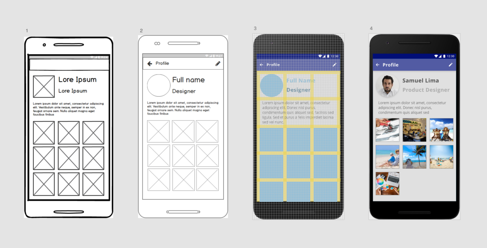

### Styleguides - Guia de estilos

> Usado para mantes o estilos nas aplicações. Para não ter que sempre ficar pensando em um visual novo para cada aplicação que for fazer

- Permitir que o time avance mais rápido
- Levar o foco para o funcional e não para o artístico

- Ter um guia de estilos é necessário para manter um alto padrão de estética, com um baixo custo de tempo. Afinal estará tudo pronto :3

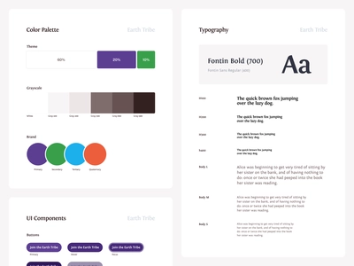

Coisas para se ter em sua biblioteca de estilos

- Texto
- Estrutura de página
- Tabelas
- Slideshows
- Elementos de navegação
- Botões de redes sociais
- Ferramenta de busca
- Listagem de artigos
- Galeria de fotos
- Módulos de links relacionados
- Carrosséis
- Botões de ação primaria e secundária

> Consistência na experiencia do usuário
> Reutilização dos elementos pelo time
> Manutenção

## sketches - Frames

São os moldes de telas que você vai trabalhar :3 

## sketches - Texto e conteúdo

Exemplo

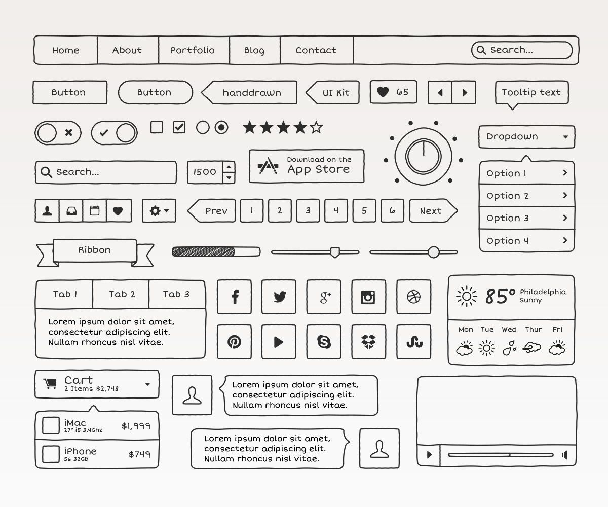

## Sketches - Representar fluxos do usuário

> Gestos que o usuário pode realizar, que você deseje representar em seu esboço

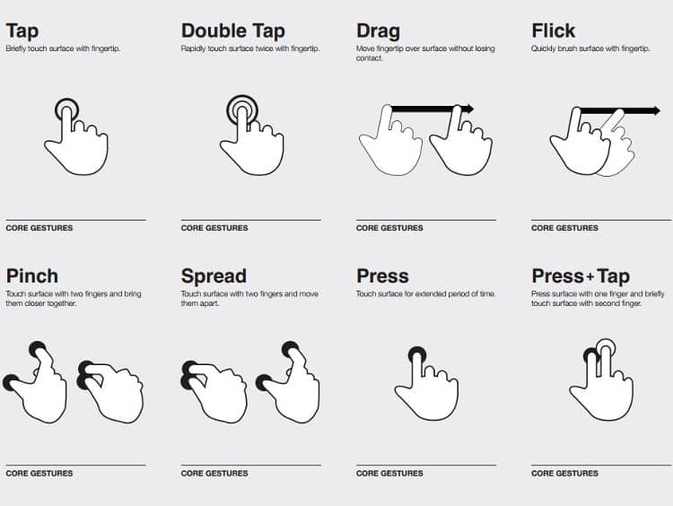

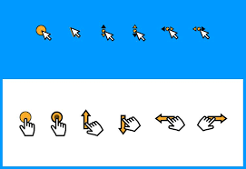

## Usabilidade e Checklist de experiencia

### Usabilidade

> 💡 Você precisa tornar a usabilidade simples

Pontos de atenção

- Remova oque não é necessário
- Esconda elementos e mostre somente quando o usuário precisar delas
- Organize os elementos
- Mova os elementos para os locais onde o usuário precise deles

#### Informações em poucas quantidades

- Exiba informações em pequenas doses
  
#### Hierarquia funcional

- Preocupe-se com hierarquias
  - Organize itens similares com visual similar
  - Evite inconsistências
  - Use cores para diferenciar as ações principais
  - Categorize
  - Use tamanhos de fonte diferentes para criar hierarquia
  - Tenha equilíbrio de textos e imagens
- Qual a ação principal?
- Quais são as ações secundárias?
- Qual o mínimo de informação que o usuário precisa saber para realizar a tarefa?
- Imagens são necessárias?
- Qual o mínimo de elementos que você precisa?
- Qual a primeira coisa que você que ele leia?

#### Simplificação de formulários

- Apresentar os conteúdos aos poucos para o usuário
- Não colocar todas as informações em uma única tela
- Pensar em fluxos de informações que facilite para o usuário

#### Adivinhar intenções, Estados, Prevenções de erros

- Diga ao usuário oque fazer a seguir
- Esclareça os pontos para os usuários - Areas de iterações bem claras
  - Botões
  - Links
  - ...
- Evite erros antes que aconteçam, prevenir o usuário de enviar informações que podem causar erros é necessário

#### Tempo do usuário

- Melhorar a usabilidade do usuário de maneira que ele possa aproveitar seu tempo da melhor forma possível
  - Exemplo - Upload de arquivos, permitindo o usuário mexer em outras telas
- Faça o trabalho pesado para seu usuário
- Deixe para o usuário somente as tarefas fáceis
- Nada de sistema complicado @-@
- Seja honesto nas coisas que você pede ao usuário
  - Esclarecer o por que necessita da informação

#### Microinterações

- Há beleza nos pequenos detalhes
- Evite elementos em excesso
- Exemplo
  - Bonequinho que se balança no google street view
  - Quando está inserindo os dados do cartão de crédito, o cartão virar visualmente para o usuário

#### Personalidade, microtextos e linguagem

- Expresse a personalidade da marca
  - Logos
  - Ícones
  - Mascotes
- Lembre-se dos microtextos
  - Like unlike
  - Postado há 3 horas em vez de postado 10/07/2022 15:00
- Comunique benefícios e não funcionalidades
- Fale a linguagem do usuário

#### Checklist de UX

*By Frabicio Teixeira*

[Download do arquivo PDF](/files/checklist-de-ux-arquitetura-da-informa%C3%A7%C3%A3o_compress.pdf)

##### Simplicidade

- Reduzir
- Revelar
- Simplificar
- Padronizar
- Priorizar
- Adiar
- Testar
- Analisar

##### Acionável

- Direcionar
- Explicar
- Indicar
- Incentivar
- Situar
- Informar
- Ajudar
- Continuar

##### Inteligente

- Destacar
- Prevenir
- Tolerar
- Automatizar
- Extrapolar
- Personalizar

##### Agradável

- Humanizar
- Considerar
- Alinhar
- Explicar
- Facilitar
- Agilizar
- Mover
- Surpreender

##### Relevante

- Entregar
- Acompanhar
- Refletir
- Escolher
- Melhorar
- Consultar

## Métricas de sucesso

### Google Analytics

> Ferramenta do Google que gera muitos números com pouco esforço

### Métricas de vaidade

> Números para você se sentir bem, mas ruim para você tomar decisões

- Empresas gostam de mostrar crescimento
- A mídia gosta de publicar números

Artigo que possa ajudar :3 

https://rafaelcosta.jusbrasil.com.br/artigos/454529208/o-jusbrasil-pode-acabar-em-6-meses-sim-definitivamente

- Olhe para as métricas certas
  - Métricas que vão te ajudar a crescer de verdade
    - Usuários que estão utilizando mesmo
    - Taxa de conversão
    - Número de produtos vendidos
    - Usuários ativos
    - Engajamento
    - Custo de aquisição de cliente
    - Receita e lucro

> Não seja enganado por suas métricas, faça uma análise critica se elas são verdadeiras.

### KPI

> Indicadores chave de desempenho ou indicadores de sucesso

> São indicadores que permitirão que você acompanhe a evolução das operações

- Foco nas metas e objetivos

*Exemplos*

- Indicadores de produtividade
  - Textos criados por analista judicial
  - Processos julgados por ministro
  - Taxa de conversão de vendas
  - Tempo de trabalho em atividades
  - Taxa de pessoas que deixaram de ser assinantes
- Indicadores de qualidade
  - Redistribuições
  - Reclassificações
  - Desaprovações
  - Praças com defeito
  - Undeploy
  - Reclamações
- Indicadores de capacidade
  - Quantidade de processos analisados por dia por área
  - Quantidade processos analisados por dia por pessoa
  - Quantidade de folhas impressas por minuto
- Indicadores estratégicos
  - Aumentar o % de empresas utilizando o produto
  - Aumenta a quantidade de processos julgados por ano
  - Aumentar o número de tribunais integrados
  
### NPS - Net Promoter Score

> Metodologia criada para medir o grau de satisfação do usuário com uma empresa

> Qual é a probabilidade de recomendar esse produto é um amigo?

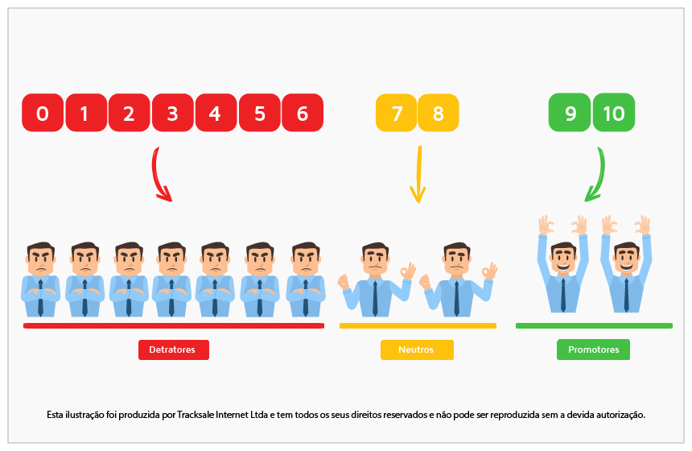

Calculo

NPS = % PROMOTORES - % DETRATORES

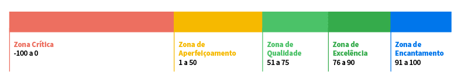

Imagem super completa

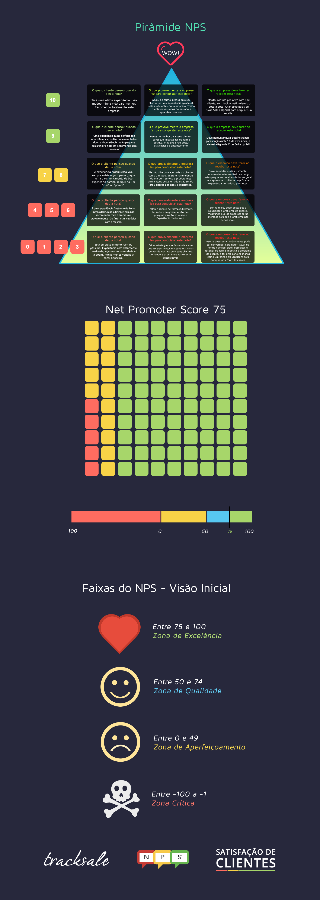

## CTR - Click through rate

> Número de vezes que o usuário clicou em seu anúncio ou call to action em relação ao total de vezes que esse elemento foi exibido para ele

CTR = Total de cliques / Total de exibições * 100

Oque fazer quando o CTR é abaixo do esperado?

- Focar mais na linguagem do público alvo
- Incluir imagens que tocam o usuário
- Melhora o call to action todo

> Fazer o CTR por etapas vai te ajudar a passar o pente fino quando necessário

## DAU - Daily active users

> Usuários ativos diariamente mede o quanto você consegue fidelizar seus usuários.

> Usuários ativos devem ser medidos de acordo com suas ações na empresa em determinado período

Também existem

- WAU - Weekly active users
- MAU - Monthly active users
- YAU - Yearly active users

### Cohort

Também é interessante medir o cohort, que é um grupo de pessoas que tem em comum algum evento, para validar o estado do grupo após apresentar esse grupo a algum desfecho.

No exemplo de apps, da para medir a quantidade de pessoas que voltaram a acessar a plataforma :3 (Fidelidade)

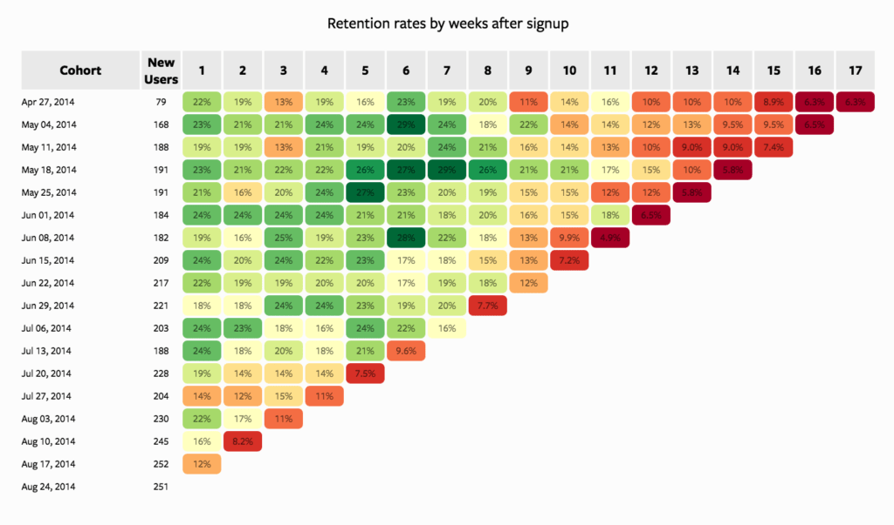

## Churn rate - Taxa de evasão

> Taxa de pessoas que deixam de ser assinantes

> Número de cancelamentos mensal pelo número de usuários ativos

Se no período fechado você teve o cancelamento de 5 clientes em uma base de 20, o percentual do churn no mês corresponde a 0,25 ou 25% 

Como reduzir o chrun?

- Manter a qualidade
- Ações de relacionamento
- Cliente satisfeito = Sucesso do negócio

## Growth rate - Taxa de crescimento

> Número de novos usuários mensal pelo numero de usuário ativos

**O GROWTH RATE SEMPRE DEVE SER MAIOR QUE O CHURN RATE**

**GROWTH RATE > CHURN RATE**

## LTV e CAC

LTV - Life time value

> Life time value é o quanto que seu cliente te entrega enquanto é assinante

Exemplo

~ 6 meses de assinatura
R$ 100,00/mês
LTV = R$ 600,00

**IMPORTANTE**

- Quanto você pode investir no cliente?
- É mais barato manter um cliente do que conquistar um novo

### CAC

> CAC é o custo de aquisição de cliente, ou quanto custa "Comprar um cliente".

> O CAC - Custo de aquisição por cliente sempre deve ser menor que o LTV, beeeeeeeeeeem menor @-@

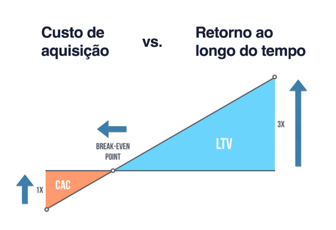

1:3 ou 1:5 é uma boa proporção CAC:LTV

R$ 1,00 investido, R$ 3,00 retorno

LTV = R$ 1000,00

CAC entre R$ 200 e R$ 333

> Se lembre de avaliar o CAC com base na aquisição do seu produto.

## Base line - Linha de base

> São seus números atuais

Atual: LTV = R$ 1500 (Linha base)
Meta: LTV = R$ 2200

- Sem linha de base é muito difícil definir metas realistas!
- Meça desde o primeiro dia!

Exemplo linha base

- Número de visitantes
- Número de páginas visitadas
- Tempo de sessão
- Fonte de tráfego

Google analytics pode ajudar \o/

## HEART - Framework de métricas de UX

> Heart é um acrônimo

- Happiness - Felicidade
  - Satisfação do usuário
  - NPS
- Engagement - Engajamento
  - Atividades do usuário
  - Uso do sistema ou app
  - Interações
- Adoption - Adoção
  - Novos usuários
  - Uso de novas funcionalidades
  - Growth rate (Taxa de crescimento)
- Retention - Retenção
  - % ativo / unidade de tempo
  - Churn rate (Taxa de saída)
  - LTV (Valor do tempo de vida do cliente)
    - Gamificação
    - Bonificações
    - Prêmios
    - Melhor atendimento (Customer service)
    - O que fazer para garantir que o cliente fique mais tempo com você?
- Task Success = Sucesso
  - Tempo de uso para realizar tarefa
  - Quantidade de tarefas completadas
  - Quantidade de erros

### Como implantar?

- Objetivos
  - Discuta com a equipe
  - Alinhamento de visão
  - Gerar consenso de onde querem chegar
- Sinais (Mercado)
  - O que te alertará que algo ocorreu?
  - Quais são os sinais de insucesso?
  - Qual é a dificuldade de coletar?
  - A coleta, quanto mais automatizada for, melhor é. Guarde energia para a analise
- Métricas
  - Refine a discussão
  - Priorize o que deseja medir
  - Reavalie periodicamente

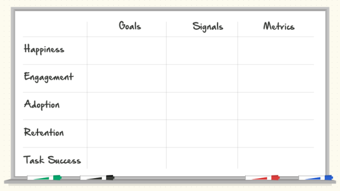

## MVP 

> Técnica para sair do estágio inicial com mais segurança

- Testar a visão do negócio
- Entregar valor aos clientes o mais cedo possível
- Reduzir o desperdício de horas inúteis de desenvolvimento
- Reduzir o risco do projeto

> conjunto de testes para validar a viabilidade do negócio. São experimentos com alguns clientes para testar um conceito.

> NÃO É UM PRODUTO INACABADO E NEM O FINAL

> É um produto completo e livre de bugs, todavia, menor que sua visão final

*Respostas que o MVP pode trazer para o negócio*

- Existe real necessidade da solução que estamos desenhando?
- Existe valor nas funcionalidade que vamos oferecer?
- Minha solução tem usabilidade?

*Como começar um MVP?*

- Seja claro e conciso
- Priorize impiedosamente
- Seja ágil
- Meça comportamentos
- Use call to actions 
- Integre com analytics
- Seja consistente com o resto da aplicação

*Dicas*

- Comece com pesquisas, landing pages
- Colete números que te deem segurança do que você vai construir
- Só então, invista no MVP em forma de software

*Exemplos*

- Pesquisas online
- Landing pages
- Teste A/B
- Protótipos de baixa, média e alta fidelidade
- Concierge
- Produtos com funcionalidades mínimas, porém úteis

> "O mínimo produto viável é a versão de um novo produto que permite ao time o mair volume de aprendizado validado sobre os clientes com o mínimo de esforço" - Eric Ries

> "Um MVP deve ser concebido não apenas para responder questões sobre o design do produto e questões técnicas; Seu objetivo é testar hipóteses fundamentais do negócio" - Eric Ries

> "Se você não tem vergonha da primeira versão do seu produto, você demorou demais para lançar" - Reid Hoffman

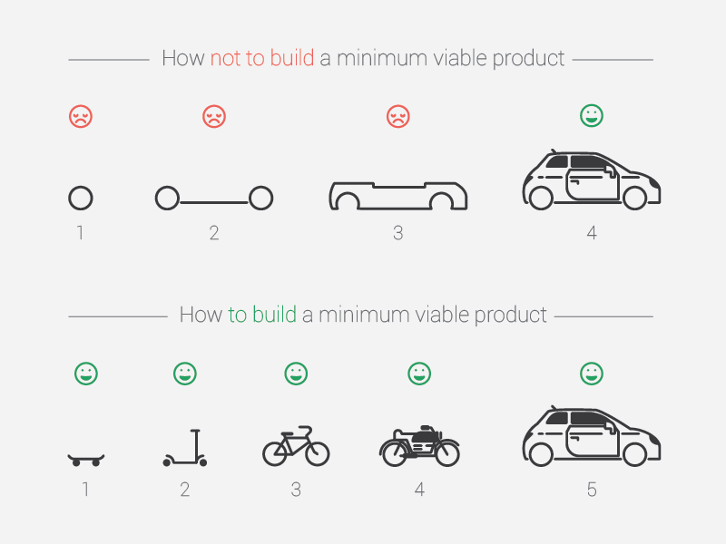

# Processos de trabalho - Lean UX: Base e princípios

## Base Design Thinking

- Empoderar a inovação
- Observar o contexto
- Propor soluções

> "inovação catalisada pela direta observação do que as pessoas querem e precisam em suas vidas e o que elas gostam ou não gostam sobre uma forma particular de como os produtos são criados, empacotados, distribuídos, vendidos e suportados..." - Tim Brow

> FAÇA COISAS QUE AS PESSOAS GOSTAM > FAÇA PESSOAS GOSTAREM DE COISAS

## Base metodologias ágeis

- Engajar todo o time
- Entregar com mais velocidade
- Gerar conhecimento
- Responder a mudanças

## Base Lean Startup

- Minimizar o risco do projeto
- Medir se o projeto está indo para o caminho certo ou não

Tem tudo haver com o business model canvas citado nas linhas mais a cima :3

## SCRUM - Termos e papéis

> É importante entender que todas as partes envolvidas na produção do produto são importantes, sendo assim, todas as pessoas devem colaborar tendo em vista a entrega do ciclo ágil.
> 
> Vale salientar que hierarquia aqui não devem ser vistas como impedidores/ditadores, todos devem se ajudar para produzirem o produto. Cada um desempenhando seu papel, porém de forma **ultra colaborativa**.

### Atores

- **Time de desenvolvimento** - Auto-organizada e multidisciplinar. Pessoas que desenvolvem e testam.
- **Product owner** (Dono do produto) - Responsável por entender a necessidade do usuário/cliente e trazer isso de maneira organizada e já priorizada tendo em base aquilo que vai trazer melhor resultado para o negócio. (Campo)
  - > O product owner é o dono do produto. Ele fornece o conhecimento do negócio em forma de requisitos para a equipe assim como sua ordem de aplicação
- **Scrum master** - Garante a cultura ágil e o desbloqueio de impedimentos. Quando o time está falhando ele é o responsável por dar uma mão ao time, ele deve garantir que todas as partes envolvidas na produção do produto, consigam entregar um trabalho com qualidade. 

A equipe deve discutir aquilo que o P.O trouxe, tendo o objetivo de ajuda-lo a tomar decisões melhores, sempre em relação ao cliente e o negócio.

### Sprint

Ciclos de desenvolvimento

### Backlog do produto

Conjunto de coisas a serem priorizadas e desenvolvidas.

Coloque somente aquilo que você quer ver com 20 % de esforço resolver 80 % do problema. Traga somente as coisas importantes, que vão entregar valor

### Backlog da sprint

Contrato que o time estabelece do que será entregue em um ciclo de desenvolvimento.

A sprint deve ser previsível, tendo uma super facilidade de estimar prazos, custos e etc... Já que é baseada em um período curto de tempo.

- Sprints não devem ser quebradas
- Aquilo que foi acordado é aquilo que deve ser entregue
- Quando uma nova atividade tem que ser encaixada a todo custo em uma sprint, o P.O deve cancelar a sprint reorganizar e começar uma nova, devido a falha no planejamento de todas as partes.
- Deve ser criterioso com o contrato da sprint.

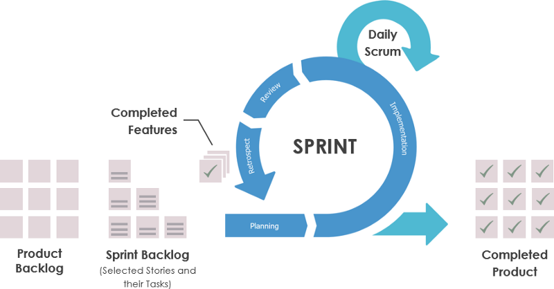

### Ritos

- Preparação (Grooming)
- Planejamento
- Reunião diária (5 a 10 minutos)
- Demonstração para o usuário
- Retrospectiva
  - Validar problemas para melhorar e ganhar maior quantidade

## Lean UX
porque nao pode 

### Equipes multidisciplinares

A equipe precisa saber de todos os aspectos do projeto, buscado trabalhar o máximo possível de forma paralela. Assim é possível evitar o modelo cascata e permitir que todos consigam fazer tudo. É tipo um devops de geral.

### Times pequenos, dedicados, juntos

Separar em times pequenos mas juntos, para promover um maior engajamento. Colocar o time para trabalhar focado em coisas especificas.

### Progresso é valor, não é só entregáveis

PROGRESSO = Coisas que trazem benefícios para o usuário e para o negócio.

### Times focados em problemas

Time focado em problemas, colocando atenção no problema do usuário, buscando trazer mais benefícios para o cliente.

### Remova o desperdício

20% do esforço entrega 80% dos benefícios

Não perca tempo com coisas que não vão ser útil para o usuário. Busque desafios para seu time, de forma que consigam ver que a tarefas que desempenham é importante e possui um propósito.

- Evite fazer funcionalidade que não vale a pena ser desenvolvida

### Pequenas entregas

Entregas pequenas que geram valor. Evite trabalhar por muito tempo em uma funcionalidade sem valida-la com o usuário. Tal funcionalidade corre o risco de não ter uma boa aceitação do público.

- Entrega pequenas ajudam a diminuir o risco do projeto.

### Entrega continua

Engaje o usuário com o seu time, dessa forma é possível ter um feed back de mercado o mais rápido possível, fazendo pequenas entregas continuamente.

### Saia do prédio

- É necessário saber oque o usuário está sentindo
- É necessário observador o mundo da ótica do usuário
- É necessário enter como o usuário trabalha e utiliza suas ferramentas
- Teste as suas hipóteses com a realidade e não com suas crenças
- Utilize sempre o contexto do usuário
- Não trabalhe em algo que ninguém quer

### Conhecimento compartilhado

Trabalhe o conhecimento compartilhado, trabalhe para que todo o seu time entenda o problema. 

Podem ajudar
- Mapas de usuários
- Blueprints
- Design Sprints

Gerar conhecimento compartilhado :3

### Times nivelados sem rockstars

Nivele a equipe. Um time nivelado cresce junto e avança junto.

Quando se coloca um ninja e dois iniciantes na equipe, é bem certo que o ninja ficará com a maioria das tarefas, ficando assim sobrecarregado, enquanto as duas pessoas iniciantes ficam aguardando o ninja ensina-las :3

Nesse cenário é mais viável montar dois times, um só com ninjas, e outro com iniciantes e um mentor.

> Se lembre que somente um diamante pode pulir outro diamante.

Quando a equipe está nivelada, o fluxo de trabalho flui melhor devido a melhor distribuição de tarefas e mais consenso técnico de acordo com os níveis.

### Externalize o trabalho

Busque maneiras que as pessoas possam externalizar suas ideias. Compartilhar ideias e objetivos é necessário para que a equipe veja sentido no trabalho e busquem juntos as melhores soluções, pois se não externalizar, colaboradores não verão sentido naquilo que estão trabalhando.

Isso deve ser implementado no dia a dia, o ambiente deve ser propicio a externalização de ideias

Coisas que podem ajudar
- Quadros colaborativos
- Painel de ideias

Ambiente de trabalho inspirador

### Criar > Analisar

Criar é melhor do que analisar. As vezes ficamos tanto tempo apenas analisando a ideia que é muito mais viável fazer um mockup e validar com o usuário, para ver se faz sentido.

- Valide que com o usuário @-@
- Traga mais o usuário para o processo
- Ter o feedback p mais rápido possível
- Busque sempre o feedback antes de qualquer achismo

### Apender antes de escalar

Usuário é o centro, então antes de escalar, é necessário ter a validação do usuário.

Valorize mais o conhecimento antes da expensão. Expandir um produto não validado por causar vários riscos.

Escale o produto na medida que ele for evoluindo junto do usuário, dessa forma ele poderá crescer de uma maneira mais forte.

### Permissão para falhar

Se quer testar alguma coisa, é necessário ter o aval de erro :)

Se você falha mais rápido você tem o sucesso mais rápido.

Experimentação traz criatividade e criatividade trás soluções inovadoras.

> Você pode falhar em uma ideia, é diferente de um produto mal feito com negligencia.

### Saia do negócio de entregáveis

O time deve focar em funcionalidades que trazem impacto para o cliente.

Quando se cria um produto é necessário ter sua documentação de funcionalidades, isso sim é necessário.

Se você conseguiu comunicar sua ideia, pronto! É isso que você precisa, não perca tempo passando toda essa etapa de comunicação de ideia para um photoshop bonito ou coisa do tipo. Isso não é oque vai resolver o problema do usuário. Foque em funcionalidades e posteriormente na documentação da regra de negócio para o cliente, isso sim gerará um valor verdadeiro para o cliente.

## Visão prototipação e valor

- Ideias melhores
- Entregas contínuas (testes)
- Erros tornam-se aprendizados
- Redução de dúvidas
  
### Principais conceitos

"Criação de entregáveis" VS "**Mudar o mundo**"

*Caminho a ser trilhado*

- Alinhamento (**Gerar consenso**)
  - Mapas de jornada do usuário
  - BluePrints
  - Duplo diamante
  - ...
- Problema
  - Deixar claro qual é a razão de um objetivo não estar sendo atingido
- Suposições
  - Oque acredita de verdade
- Hipóteses
  - Crença quebrada em um formato testável
- Valor
  - Sinal que o mercado te entrega, para validar se está no caminho certo. (Quantitativo ou qualitativo)
- Personas
  - Modelo de pessoa da qual você acredita estar resolvendo um problema
- Funcionalidades
  - Inovações que acreditamos que gerarão o valor para o nosso usuário

> Nunca trate suposições como fatos!
> 
> Dê voz a todos do time!

### Preparação

> Avise a todos com antecedência qual problema tentarão atacar

- Como o produto é usado hoje
- comportamento comuns
- Tentativas de solução anteriores
- Por que resolver o problema melhora a performance do negócio?
- Benchmarking - como os competidores resolvem?

### Definição de problema

> Definição do objetivo o que impede o objetivo ser atingido e quando você saberá que o objetivo foi atingido

> Qual é o pedido explicito de melhoria?

*Modelo que pode ser seguido*

"Nosso **PRODUTO OU SERVIÇO**" foi desenhado par atingir "**ESSES OBJETIVOS**".

Nós observamos que quando o "**PRODUTO OU SERVIÇO**" não atinge "**ESSES OBJETIVOS**", isso causa "**ESSES EFEITOS ADVERSOS**" para o nosso negócio.

Como nós poderíamos melhorar esses "**SERVIÇO OU PRODUTO**" para que nossos usuários tivessem mais sucesso baseado em "**ESSES CRITÉRIOS DE MEDIDA E MONITORAMENTO**"

### Suposições

> Tudo que você não validou com os usuários é apenas uma suposição

*Modelo*

Eu acredito que meus usuários precisam de: 
Essas necessidades podem ser resolvidas com: 
Meus usuários iniciais são (ou serão): 
O Valor #1 que o usuário quer do meu serviço é: 
O usuário também pode ter os seguintes benefícios: 
A maioria dos meus usuários serão conquistados por: 
Eu farei dinheiro/gerarei benefício assim: 
Meu principal competidor/similar no mercado é: 
Eu serei melhor que eles assim: 
O maior risco do meu produto é: 
Nós resolveremos esse risco assim: 
Que outras suposições temos que, se provadas falsas, falham o projeto?

*Exemplo*

Eu acredito que a maioria dos usuários do STF são Advogados e Cidadãos 
Eu acredito que um processo eletrônico é julgado mais rápido que um processo físico 
Eu acredito que exibindo sugestões de preços, os empreendedores vão utilizar e lucrar mais 

*Suposições para descobrir quem é o usuário*

Como o nosso produto se encaixa na vida desse usuário? 
Que problemas esse produto resolve? 
Quando e como esse produto é usado? 
Que funcionalidades são importantes? 
Como nosso produto deve parecer ou se comportar?

### Priorização

> A lista de suposições será sempre extensa. Você precisa priorizar.
>
> RISCO X CONHECIMENTO 

POUCO RISCO - MUITA CERTEZA = Tranquilo nem precisa validar
POUCO RISCO - POUCA CERTEZA = Vale a pena validar
ALTO RISCO - MUITA CERTEZA = Tem que tomar cuidado, pois isso pode invalidar seu negócio
ALTO RISCO - POUCA CERTEZA = Vai validar muito forte isso aqui! Se estiver errado o negócio é invalidado. E você pode tomar um baita prejuízo.

*Exemplo:*

(BAIXO RISCO - MUITA CERTEZA) - Eu acredito que muitas pessoas gostam de andar de bicicleta 
(BAIXO RISCO - POUCA CERTEZA) - Eu acredito que muitas pessoas usam bicicletas caras 
(ALTO RISCO - MUITA CERTEZA) - Eu acredito que as pessoas tem medo de ter a bicicleta roubada 
(**ALTO RISCO - POUCA CERTEZA**) - Eu acredito que as pessoas pagariam por um seguro de bicicleta 
(**ALTO RISCO - POUCA CERTEZA**) - Eu acredito que seguro de bicicleta é um oceano azul 

### Hipóteses

> Para a suposição se tornar um fato, você precisa validá-la. A hipótese garante que você faça isso utilizando mais razão e menos emoção.

Qual sinal você precisa para ter mais certeza de que está certo?

Nós acreditamos que [essa declaração é verdadeira].
Nós saberemos que estamos [certos/errados]
quando tivermos esse feedback do mercado
[feedback qualitativo] ou [feedback quantitativo] ou
[ou mudança de KPI (indicador de performance)].   

*Exemplo*

Nós acreditamos que:

A complexidade do peticionamento gera dados ruins que atrasam o trâmite processual

Nós saberemos que isso é verdadeiro se:

- 30% das dúvidas ou reclamações forem sobre como peticionar 
- 80% dos formulários estiverem com preenchimento errado 
- 30% dos atendimentos do call center forem sobre peticionar

### Valor - Objetivos

- Valor (Negócio e usuário)
- Personas
- Funcionalidades

> Valor é o beneficio que você quer entregar.

*Valor para o usuário*

É possível facilitar que as pessoas entendam melhor a constituição e a jurisprudência? 
- **% de buscas com sucesso**
  
É possível levar a informação dos livros do STF ao conhecimento de mais pessoas?
- **Downloads**

**Valor para o negócio:**

É possível aumentar o número de usuário premium?
- % usuários premium
****
É possível aumentar o número de usuários recorrentes?
- retuning/new visitors

É possível aumentar o LTV?
- R$ LTV

### Personas

Modelo para criação de persona

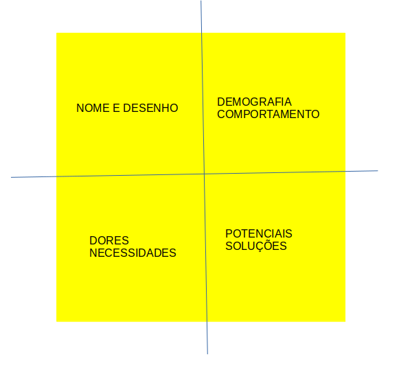

### Funcionalidades

A partir dos valores e das personas:

Que funcionalidades, produtos e serviços podemos oferecer?

> No Lean UX, as funcionalidades existem para servir as necessidades no negócio, do cliente e do usuário

*Modelo:*

- Nos vamos [Criar essa funcionalidade]
- Para [Essa Persona]
- Para ela conseguir [Esse valor]
- E meu negócio conseguir [Esse valor]
  
*Exemplo:*

- Nos valore criar sugestões de preços
- Para Dona Raimunda
- PAra ela conseguir não perder dinheiro nas vendas
- E meu negócio conseguir manter o usuário ativo por 10% mais tempo (LTV)

> Mas se lembre que é necessário validar a hipóteses

> VocÊ precisará transformar a tabela de funcionalidades em job story antes de passar para o time de construção

- Como: [Empresa/Estado atual]
- Quando estou:
- Preciso de:
- Para:

# Referencias

[https://www.udemy.com/course/ux-design/](https://www.udemy.com/course/ux-design/)

# Conteúdos para validar posteriormente

[https://www.thesprintbook.com/book](https://www.thesprintbook.com/book)

[http://gv.com/sprint](http://gv.com/sprint)

**Métodos e entregáveis de UX**

***Service Design Tools -*** [https://servicedesigntools.org/tools/service-blueprint](https://servicedesigntools.org/tools/service-blueprint)

**Princípios de Design de produto -** [https://www.designbetter.co/principles-of-product-design/story-first](https://www.designbetter.co/principles-of-product-design/story-first)

**Exemplo de Golden Path -** [https://classroom.udacity.com/courses](https://classroom.udacity.com/courses)

**Exemplo de Press Release -** [https://classroom.udacity.com/courses](https://classroom.udacity.com/courses)

**Replacing User Story by Job Story -** [https://jtbd.info/replacing-the-user-story-with-the-job-story-af7cdee10c27](https://jtbd.info/replacing-the-user-story-with-the-job-story-af7cdee10c27)

**O analista do modelo de negócios. -** [https://analistamodelosdenegocios.com.br/shop/](https://analistamodelosdenegocios.com.br/shop/)

**Design sprints -** [https://pt.slideshare.net/br2msi/google-design-sprint](https://pt.slideshare.net/br2msi/google-design-sprint)

**Moodboard -** [http://www.cutedrop.com.br/2011/03/mood-board/](http://www.cutedrop.com.br/2011/03/mood-board/)

**Moodboard -** [http://www.gomoodboard.com/boards/0RjhnKcK/share](http://www.gomoodboard.com/boards/0RjhnKcK/share)

**Design Thinking -** [https://www.slideshare.net/ColetivoMola/design-thinking-como-potencializador-do-empreendedorismo-63968357](https://www.slideshare.net/ColetivoMola/design-thinking-como-potencializador-do-empreendedorismo-63968357)

Design Thinking - [https://pt.linkedin.com/pulse/como-os-designers-pensam-o-duplo-diamante-alexandre-mourão-dos-santos](https://pt.linkedin.com/pulse/como-os-designers-pensam-o-duplo-diamante-alexandre-mour%C3%A3o-dos-santos)

Design Thinking - [https://designthinking.ideo.com/search/?q=how-might-we](https://designthinking.ideo.com/search/?q=how-might-we)

**Crazy 8s -** [http://blog.caelum.com.br/crazy-eights-uma-tecnica-rapida-e-visual-para-explorar-ideias-com-seu-time/](http://blog.caelum.com.br/crazy-eights-uma-tecnica-rapida-e-visual-para-explorar-ideias-com-seu-time/)

**MVP -** [https://endeavor.org.br/mvp/](https://endeavor.org.br/mvp/)
**MVP -** https://appsamurai.com/mobile-app-mvp-why-and-how-to-build-it/

**Vanity metrics -** [https://tim.blog/2009/05/19/vanity-metrics-vs-actionable-metrics/](https://tim.blog/2009/05/19/vanity-metrics-vs-actionable-metrics/)
**Vanity metrics -** https://techcrunch.com/2011/07/30/vanity-metrics/

**KPIs -** [https://endeavor.org.br/kpi/](https://endeavor.org.br/kpi/)

**KPIs -** [https://pluga.co/blog/empreendedorismo/indicadores-de-produtividade](https://pluga.co/blog/empreendedorismo/indicadores-de-produtividade)

**NPS -** [https://satisfacaodeclientes.com/o-que-o-net-promoter-score/](https://satisfacaodeclientes.com/o-que-o-net-promoter-score/)

**DAU -** https://blog.innertrends.com/active-users-2/

**Churn -** [https://www.asaas.com/blog/entendendo-o-que-e-churn-rate-e-porque-ele-e-importante-para-sua-startup-saas/](https://www.asaas.com/blog/entendendo-o-que-e-churn-rate-e-porque-ele-e-importante-para-sua-startup-saas/)

**Entrevista usabilidade -** [https://measuringu.com/five-users/](https://measuringu.com/five-users/)

**Cardsorting -** [http://www.imarklab.com/en/2016/10/6-basic-principles-better-understand-card-sorting-tree-testing/](http://www.imarklab.com/en/2016/10/6-basic-principles-better-understand-card-sorting-tree-testing/)

**Cardsorting -** [http://www.maxandriani.art.br/2012/11/20/card-sorting-uma-janela-para-a-mente](http://www.maxandriani.art.br/2012/11/20/card-sorting-uma-janela-para-a-mente)

**UX Design e impacto de performance -** [https://brasil.uxdesign.cc/a-importância-da-performance-das-páginas-na-experiência-do-usuário-36c375876e87](https://brasil.uxdesign.cc/a-import%C3%A2ncia-da-performance-das-p%C3%A1ginas-na-experi%C3%AAncia-do-usu%C3%A1rio-36c375876e87)
****